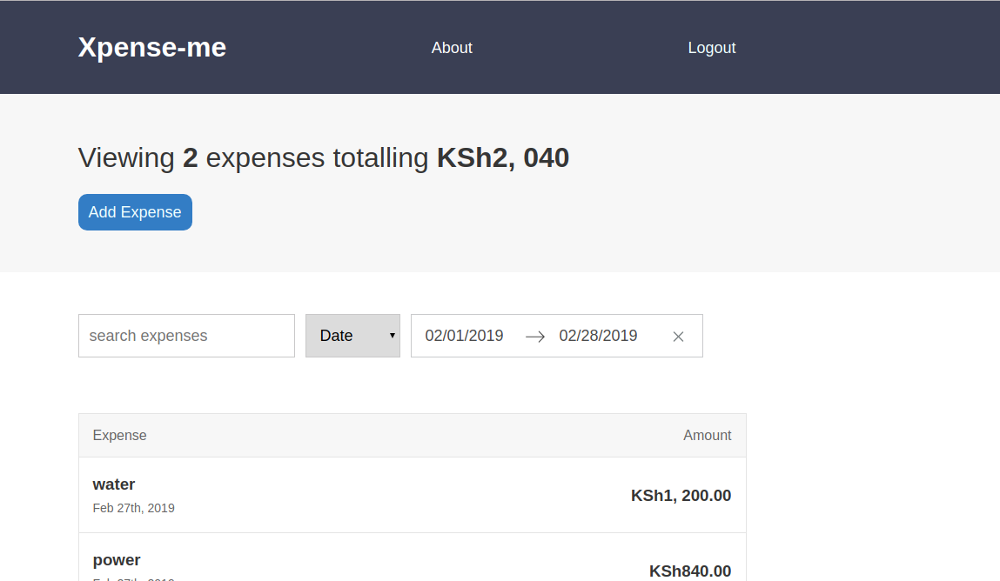
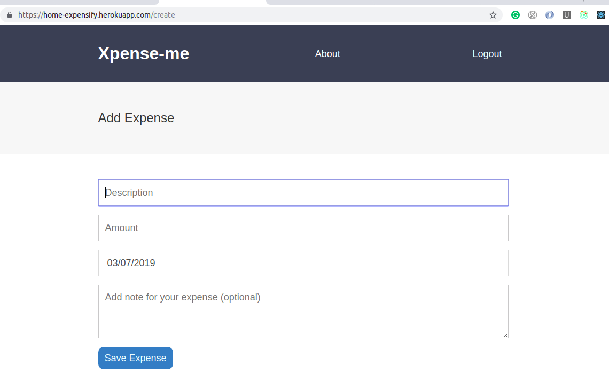
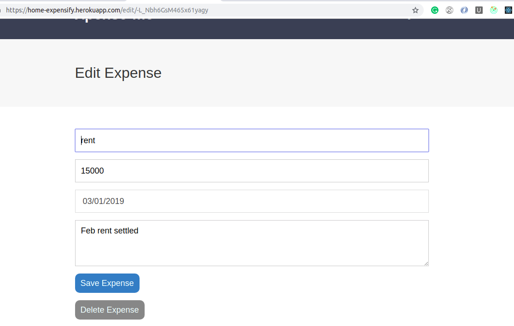

# Xpense-Me App

## [Watch it Live](https://home-expensify.herokuapp.com/)
A React.js App that let you keep record of your expenditures.

## Technologies Used:  
  * React.js
  * SASS
  * Node.js
  * Express.js
  * Firebase

## To run locally

```javascript
  cd expensify-app
  yarn install
  yarn run dev-server
```

### Previews

 <br> 
  
  
  